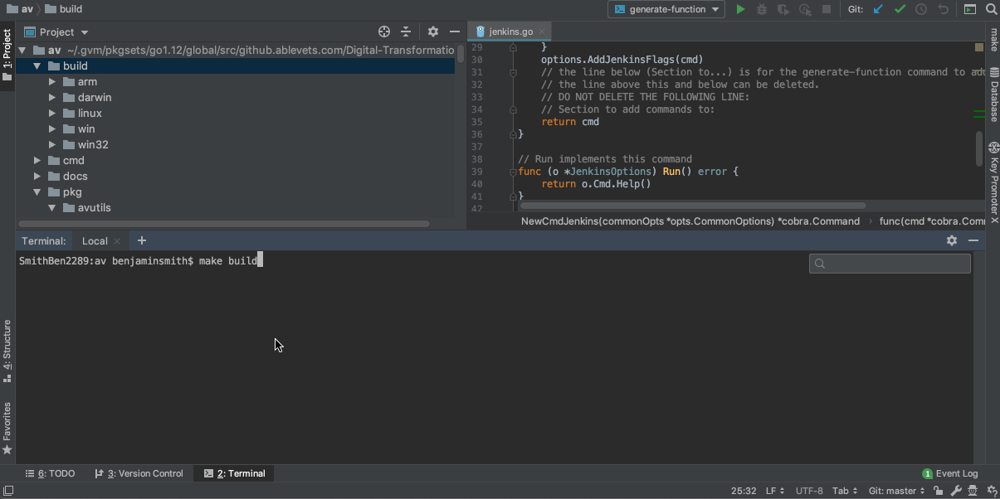

## Project Summary

Go based project for utilties inside ablevets.

## Building

Run `make build` from the project root, this will build your local OS's binary.

Alternatively run `make all` to build every operating system.

### Requirements

Go Version **1.12.4**

This can be done through [**GVM**](https://github.com/moovweb/gvm) a golang version manager
and running `gvm install go1.12.4`

### generating a new command

#### adding a base:

**Experimental**

#### adding a command to a base:

